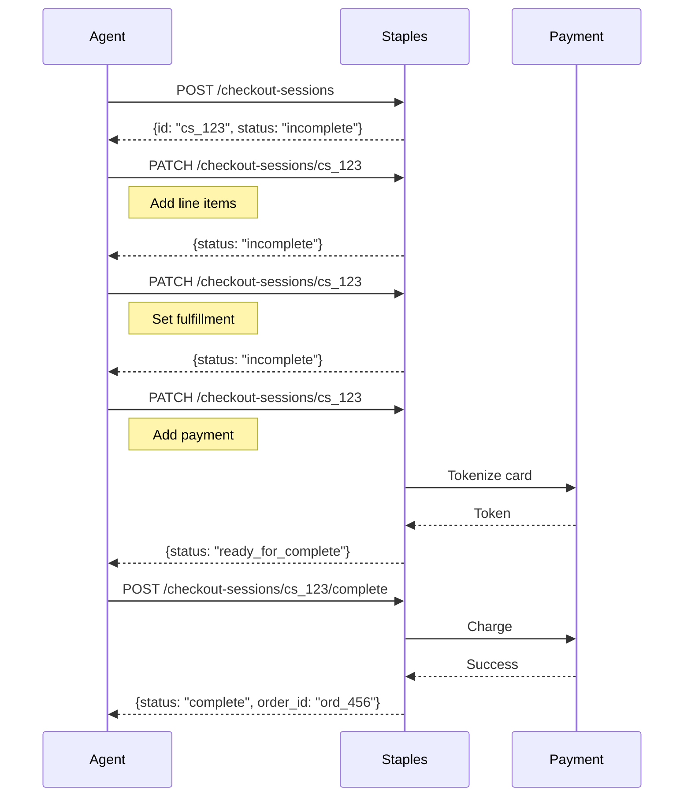
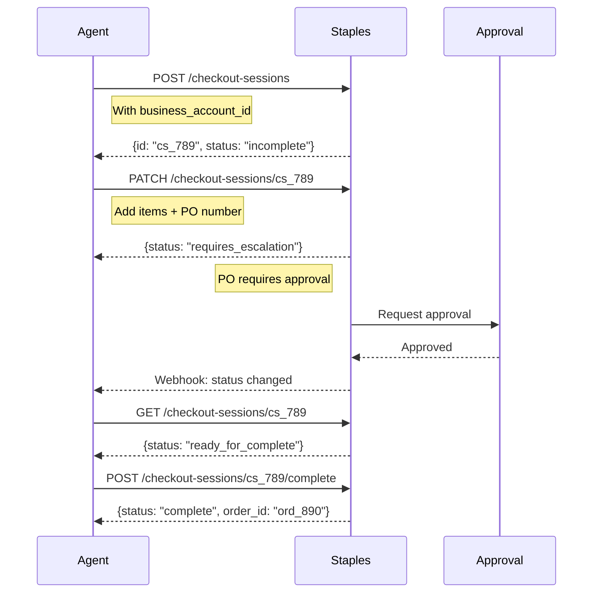

# Staples Agentic Commerce Integration Plan

This document outlines the comprehensive plan for integrating the Universal Commerce Protocol (UCP) to enable agentic commerce capabilities for Staples.

---

## Executive Summary

Staples, as a leading office supplies retailer serving both consumers and businesses, is an ideal candidate for UCP integration. This plan covers enabling AI agents to:
- Browse and search Staples' product catalog
- Check inventory and pricing
- Complete checkout with multiple fulfillment options
- Handle B2B purchasing workflows (bulk orders, purchase orders, accounts payable)
- Manage recurring orders and subscriptions

---

## Phase 1: Discovery Profile & Capability Declaration

### 1.1 Create Staples UCP Discovery Profile

**Task:** Implement the `/.well-known/ucp` discovery endpoint

**File to create:** Staples Discovery Profile

```json
{
  "name": "Staples",
  "description": "Office supplies, technology, furniture, and business services",
  "capabilities": [
    {
      "name": "dev.ucp.shopping.checkout",
      "version": "2026-01-11",
      "spec": "https://ucp.dev/spec/checkout",
      "schema": "https://api.staples.com/ucp/schemas/checkout.json"
    },
    {
      "name": "dev.ucp.shopping.order",
      "version": "2026-01-11",
      "spec": "https://ucp.dev/spec/order",
      "schema": "https://api.staples.com/ucp/schemas/order.json"
    },
    {
      "name": "dev.ucp.shopping.fulfillment",
      "version": "2026-01-11",
      "spec": "https://ucp.dev/spec/fulfillment",
      "schema": "https://api.staples.com/ucp/schemas/fulfillment.json"
    },
    {
      "name": "dev.ucp.common.identity_linking",
      "version": "2026-01-11",
      "spec": "https://ucp.dev/spec/identity-linking"
    }
  ],
  "services": {
    "shopping": {
      "version": "2026-01-11",
      "spec": "https://ucp.dev/spec/shopping-service",
      "bindings": {
        "rest": {
          "schema": "https://api.staples.com/ucp/openapi.json",
          "endpoint": "https://api.staples.com/ucp/v1"
        },
        "mcp": {
          "schema": "https://api.staples.com/ucp/openrpc.json",
          "endpoint": "https://api.staples.com/ucp/mcp"
        }
      }
    }
  },
  "signing_keys": [
    {
      "kty": "EC",
      "crv": "P-256",
      "kid": "staples-signing-key-1",
      "x": "...",
      "y": "..."
    }
  ]
}
```

### 1.2 Implementation Steps

| Step | Description | Owner |
|------|-------------|-------|
| 1 | Register domain namespace `com.staples` with UCP governance | Legal/Engineering |
| 2 | Generate signing key pairs for response verification | Security Team |
| 3 | Deploy discovery endpoint at `/.well-known/ucp` | Platform Team |
| 4 | Configure CORS headers for cross-origin agent access | Platform Team |

---

## Phase 2: Core Shopping Capabilities

### 2.1 Checkout Capability Implementation

**Capability:** `dev.ucp.shopping.checkout`

**Required Endpoints:**

| Method | Endpoint | Description |
|--------|----------|-------------|
| POST | `/checkout-sessions` | Create new checkout session |
| PATCH | `/checkout-sessions/{id}` | Update checkout session |
| GET | `/checkout-sessions/{id}` | Retrieve checkout session |
| POST | `/checkout-sessions/{id}/complete` | Complete checkout |

**Staples-Specific Considerations:**

1. **Product Catalog Integration**
   - Map Staples SKUs to UCP line items
   - Include product metadata (brand, category, specifications)
   - Support variable pricing (member vs. non-member)

2. **Pricing & Discounts**
   - Staples Rewards pricing integration
   - B2B contract pricing
   - Volume discounts for bulk orders
   - Promotional codes and coupons

3. **Inventory Management**
   - Real-time inventory availability
   - Store-level inventory for BOPIS
   - Backorder handling

### 2.2 Checkout Schema Extension

**File:** `/source/schemas/staples/checkout_extension.json`

```json
{
  "$id": "https://api.staples.com/ucp/schemas/checkout_extension.json",
  "title": "Staples Checkout Extension",
  "allOf": [
    { "$ref": "https://ucp.dev/schemas/shopping/checkout.json" }
  ],
  "properties": {
    "staples_rewards_number": {
      "type": "string",
      "description": "Staples Rewards membership number"
    },
    "business_account_id": {
      "type": "string",
      "description": "Staples Advantage business account ID"
    },
    "purchase_order_number": {
      "type": "string",
      "description": "Customer PO number for B2B orders"
    },
    "cost_center": {
      "type": "string",
      "description": "Cost center for expense allocation"
    }
  }
}
```

---

## Phase 3: Fulfillment Extension

### 3.1 Fulfillment Methods

**Capability:** `dev.ucp.shopping.fulfillment`

Staples must support these fulfillment methods:

| Method ID | Name | Description |
|-----------|------|-------------|
| `ship_to_home` | Standard Shipping | Ship to customer address |
| `ship_to_home_express` | Express Shipping | 1-2 day delivery |
| `bopis` | Buy Online, Pickup In Store | Same-day store pickup |
| `curbside` | Curbside Pickup | Contactless curbside |
| `same_day_delivery` | Same Day Delivery | Local courier delivery |
| `ship_to_store` | Ship to Store | Ship to store for pickup |

### 3.2 Fulfillment Schema Implementation

```json
{
  "fulfillment_methods": [
    {
      "id": "ship_to_home",
      "type": "shipping",
      "name": "Standard Shipping",
      "description": "Delivery in 3-5 business days",
      "price": {
        "amount": "0.00",
        "currency": "USD"
      },
      "free_threshold": {
        "amount": "50.00",
        "currency": "USD"
      }
    },
    {
      "id": "bopis",
      "type": "retail_location",
      "name": "Free Store Pickup",
      "description": "Ready in 1 hour at your local store",
      "requires_location_selection": true
    }
  ]
}
```

### 3.3 Store Locator Integration

- Integrate with Staples store locator API
- Return store hours, capabilities, and real-time inventory
- Support store-specific pricing and availability

---

## Phase 4: Order Management

### 4.1 Order Capability Implementation

**Capability:** `dev.ucp.shopping.order`

**Required Endpoints:**

| Method | Endpoint | Description |
|--------|----------|-------------|
| GET | `/orders/{id}` | Retrieve order details |
| GET | `/orders` | List orders with filters |

### 4.2 Fulfillment Event Types

Staples-specific fulfillment events:

| Event Type | Description |
|------------|-------------|
| `order_placed` | Order successfully placed |
| `order_confirmed` | Order confirmed by Staples |
| `processing` | Order being processed |
| `picking` | Items being picked (store/warehouse) |
| `packed` | Items packed for shipment |
| `shipped` | Items shipped with tracking |
| `out_for_delivery` | With delivery carrier |
| `ready_for_pickup` | Ready at store for pickup |
| `picked_up` | Customer picked up order |
| `delivered` | Order delivered |
| `return_initiated` | Return process started |
| `return_received` | Return received by Staples |
| `refund_processed` | Refund issued |

---

## Phase 5: Payment Handlers

### 5.1 Supported Payment Methods

| Payment Method | Handler Type | Implementation |
|----------------|--------------|----------------|
| Credit/Debit Cards | Platform Tokenizer | Staples payment gateway |
| Staples Rewards | Business Tokenizer | Internal rewards system |
| Business Account | Business Tokenizer | Net terms/invoicing |
| Purchase Orders | Business Tokenizer | B2B PO processing |
| PayPal | External Handler | PayPal integration |
| Apple Pay | Platform Tokenizer | Apple Pay gateway |
| Google Pay | Platform Tokenizer | Google Pay gateway |

### 5.2 B2B Payment Handling

**Staples Advantage Business Accounts:**

```json
{
  "payment_handler": {
    "id": "staples_business_account",
    "name": "Staples Business Account",
    "type": "business_tokenizer",
    "supported_instruments": [
      {
        "type": "business_credit_line",
        "net_terms": [30, 45, 60],
        "requires_po": true
      },
      {
        "type": "corporate_card",
        "managed_by": "staples_advantage"
      }
    ]
  }
}
```

---

## Phase 6: Identity Linking (OAuth 2.0)

### 6.1 Staples Account Linking

**Capability:** `dev.ucp.common.identity_linking`

**OAuth 2.0 Endpoints:**

| Endpoint | URL |
|----------|-----|
| Authorization | `https://auth.staples.com/oauth/authorize` |
| Token | `https://auth.staples.com/oauth/token` |
| Userinfo | `https://auth.staples.com/oauth/userinfo` |

**Scopes:**

| Scope | Description |
|-------|-------------|
| `profile` | Basic profile information |
| `orders.read` | View order history |
| `orders.write` | Create and modify orders |
| `cart.write` | Manage shopping cart |
| `rewards.read` | View rewards balance |
| `business.read` | View business account info |
| `business.purchase` | Make business purchases |

### 6.2 Business Account Linking

For B2B customers, additional authorization flow:

1. User authenticates with personal credentials
2. User selects business account to link
3. Business admin approval workflow (if required)
4. Agent receives scoped access to business account

---

## Phase 7: Staples-Specific Extensions

### 7.1 Custom Capabilities

**7.1.1 Print & Marketing Services**

```
Capability: com.staples.services.print
```

- Document printing
- Business cards
- Marketing materials
- Signs and banners

**7.1.2 Technology Services**

```
Capability: com.staples.services.tech
```

- Device setup and configuration
- Tech support scheduling
- Virus removal services

**7.1.3 Subscription Services**

```
Capability: com.staples.shopping.subscription
```

- Recurring orders (ink, paper, cleaning supplies)
- Subscribe & save discounts
- Auto-replenishment

### 7.2 Staples Rewards Integration

```json
{
  "capability": "com.staples.loyalty.rewards",
  "version": "2026-01-11",
  "extends": "dev.ucp.shopping.checkout",
  "config": {
    "rewards_earning_rate": "5%",
    "rewards_redemption_rate": "1 point = $0.01"
  }
}
```

---

## Phase 8: API Implementation Architecture

### 8.1 System Architecture

```
┌─────────────────────────────────────────────────────────────────┐
│                         AI Agent                                │
│                    (Claude, GPT, etc.)                          │
└───────────────────────────┬─────────────────────────────────────┘
                            │
                            │ UCP Protocol (REST/MCP)
                            ▼
┌─────────────────────────────────────────────────────────────────┐
│                    Staples UCP Gateway                          │
│  ┌──────────────┐  ┌──────────────┐  ┌──────────────┐          │
│  │   Discovery  │  │   Auth/      │  │   Request    │          │
│  │   Service    │  │   Identity   │  │   Validator  │          │
│  └──────────────┘  └──────────────┘  └──────────────┘          │
└───────────────────────────┬─────────────────────────────────────┘
                            │
        ┌───────────────────┼───────────────────┐
        │                   │                   │
        ▼                   ▼                   ▼
┌───────────────┐   ┌───────────────┐   ┌───────────────┐
│   Checkout    │   │    Order      │   │   Payment     │
│   Service     │   │   Service     │   │   Service     │
└───────────────┘   └───────────────┘   └───────────────┘
        │                   │                   │
        └───────────────────┼───────────────────┘
                            │
                            ▼
┌─────────────────────────────────────────────────────────────────┐
│                  Staples Backend Systems                        │
│  ┌──────────┐  ┌──────────┐  ┌──────────┐  ┌──────────┐        │
│  │  Product │  │ Inventory│  │  Order   │  │ Customer │        │
│  │  Catalog │  │  System  │  │  Mgmt    │  │  Data    │        │
│  └──────────┘  └──────────┘  └──────────┘  └──────────┘        │
└─────────────────────────────────────────────────────────────────┘
```

### 8.2 Technology Stack Recommendations

| Component | Technology | Rationale |
|-----------|------------|-----------|
| API Gateway | Kong / AWS API Gateway | Rate limiting, auth, routing |
| UCP Service | Node.js / Go | JSON Schema validation, fast |
| Message Queue | Apache Kafka | Event-driven order processing |
| Cache | Redis | Session storage, inventory cache |
| Database | PostgreSQL | Order and checkout persistence |

---

## Phase 9: Testing & Validation

### 9.1 Conformance Testing

Use UCP validation tools to ensure compliance:

```bash
# Validate discovery profile
python validate_specs.py --profile https://api.staples.com/.well-known/ucp

# Validate API schemas
python validate_specs.py --openapi https://api.staples.com/ucp/openapi.json
```

### 9.2 Test Scenarios

| Scenario | Description |
|----------|-------------|
| Basic Checkout | Add items → Set shipping → Pay → Complete |
| BOPIS Flow | Add items → Select store → Pay → Complete → Pickup |
| B2B Order | Business auth → Add items → Apply PO → Net terms → Complete |
| Subscription | Create subscription → Process recurring order |
| Return/Refund | Initiate return → Ship → Receive → Process refund |
| Multi-fulfillment | Split order (some ship, some pickup) |

### 9.3 Agent Integration Testing

Test with multiple AI agent platforms:

- Claude (Anthropic)
- ChatGPT (OpenAI)
- Gemini (Google)
- Custom enterprise agents

---

## Phase 10: Launch & Operations

### 10.1 Rollout Plan

| Stage | Scope | Duration |
|-------|-------|----------|
| Alpha | Internal testing | 4 weeks |
| Beta | Select partners | 6 weeks |
| Limited GA | 10% traffic | 4 weeks |
| Full GA | 100% traffic | Ongoing |

### 10.2 Monitoring & Observability

| Metric | Target | Alert Threshold |
|--------|--------|-----------------|
| API Latency (p95) | < 500ms | > 1000ms |
| Error Rate | < 0.1% | > 1% |
| Checkout Completion | > 85% | < 70% |
| Discovery Uptime | 99.9% | < 99.5% |

### 10.3 Support & Documentation

- API documentation portal
- Developer sandbox environment
- Agent testing tools
- Support ticketing for agent developers

---

## Implementation Checklist

### Phase 1: Discovery & Setup
- [ ] Register `com.staples` namespace
- [ ] Generate signing keys
- [ ] Deploy discovery endpoint
- [ ] Configure CORS

### Phase 2: Core Checkout
- [ ] Implement checkout session API
- [ ] Integrate product catalog
- [ ] Implement pricing engine
- [ ] Add inventory checking

### Phase 3: Fulfillment
- [ ] Implement shipping methods
- [ ] Integrate store locator
- [ ] Add BOPIS capability
- [ ] Implement same-day delivery

### Phase 4: Orders
- [ ] Implement order retrieval
- [ ] Add fulfillment events
- [ ] Integrate tracking providers
- [ ] Add returns/refunds

### Phase 5: Payments
- [ ] Implement card tokenization
- [ ] Add digital wallets
- [ ] Integrate business accounts
- [ ] Add PO processing

### Phase 6: Identity
- [ ] Implement OAuth 2.0 flow
- [ ] Add consumer account linking
- [ ] Add business account linking
- [ ] Implement scope controls

### Phase 7: Extensions
- [ ] Add rewards integration
- [ ] Implement subscriptions
- [ ] Add print services (optional)
- [ ] Add tech services (optional)

### Phase 8: Infrastructure
- [ ] Deploy API gateway
- [ ] Set up monitoring
- [ ] Configure rate limiting
- [ ] Implement caching

### Phase 9: Testing
- [ ] Conformance testing
- [ ] Integration testing
- [ ] Load testing
- [ ] Security audit

### Phase 10: Launch
- [ ] Alpha release
- [ ] Beta program
- [ ] GA rollout
- [ ] Documentation portal

---

## Appendix A: Sample API Flows

### A.1 Basic Checkout Flow



### A.2 B2B Purchase Order Flow



---

## Appendix B: Error Handling

### Standard Error Responses

```json
{
  "error": {
    "code": "invalid_fulfillment_method",
    "message": "Selected fulfillment method not available for all items",
    "details": {
      "unavailable_items": ["SKU123", "SKU456"],
      "reason": "Items not available for store pickup at selected location"
    }
  }
}
```

### Error Codes

| Code | Description | Resolution |
|------|-------------|------------|
| `item_unavailable` | Item out of stock | Remove or substitute item |
| `invalid_address` | Cannot deliver to address | Correct address or change method |
| `payment_declined` | Payment failed | Try different payment method |
| `po_approval_required` | PO needs approval | Wait for approval or escalate |
| `store_unavailable` | Store cannot fulfill | Select different store |

---

## Appendix C: Security Considerations

### Authentication
- OAuth 2.0 Bearer tokens for identity-linked requests
- API keys for anonymous/guest checkout
- HMAC signatures for webhook verification

### Data Protection
- PCI DSS compliance for payment data
- Encrypt PII at rest and in transit
- Tokenize all payment credentials

### Rate Limiting
- 1000 requests/minute per API key
- 100 checkout creates/minute per IP
- Adaptive throttling for abuse prevention

---

*Document Version: 1.0*
*Last Updated: 2026-01-15*
*Author: UCP Integration Team*
